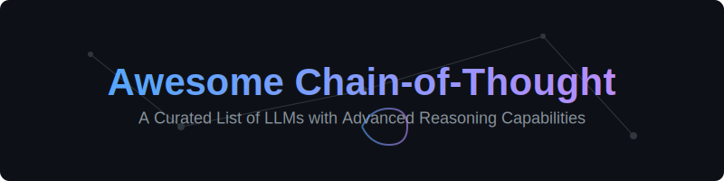

  

  # Awesome Chain-of-Thought (CoT) 🧠🤖

  
  
  
  
  

  **A curated list of state-of-the-art Large Language Models (LLMs) featuring built-in reasoning, "Deep Thinking," and Chain-of-Thought (CoT) architectures.**

---

## 📖 Overview
Chain-of-Thought (CoT) prompting has transitioned from a prompt engineering trick into a **fundamental model architecture**. This repository tracks the evolution of AI models that don't just predict the next token, but **reason, plan, and verify** their thoughts before responding.

### 🚀 Key Features of Reasoning Models:
- **Step-by-Step Logic:** Breaking complex problems into manageable sub-tasks.
- **Self-Correction:** Identifying and fixing errors during the "thinking" phase.
- **Verification:** Cross-checking facts and logic before final output.
- **Computing-at-Inference:** Allocating more compute time for harder problems.

---

## 🗂️ Table of Contents
- [🏢 Leading Proprietary Models](#-leading-proprietary-models)
- [🌐 Top Open-Source & Open-Weight Models](#-top-open-source--open-weight-models)
- [📚 Useful Resources](#-useful-resources)
- [📄 Detailed Documentation](#-detailed-documentation)

---

## 🏢 Leading Proprietary Models

| Model 🤖 | Key Features ✨ | Year 📅 | Paper / Resource Link 🔗 |
| :--- | :--- | :--- | :--- |
| [**OpenAI (o-series)**](./docs/openai-o-series.md) | Models like o1 and o3-mini use reinforcement learning to generate internal reasoning tokens. | 2024 | [OpenAI o1 System Card](https://arxiv.org/abs/2412.16720) |
| [**Google Gemini**](./docs/google-gemini.md) | Features **"Deep Think"** and **"Think Mode"** for multi-step reasoning. | 2025 | [Gemini 2.5 Technical Report](https://storage.googleapis.com/deepmind-media/gemini/gemini_2_5_report.pdf) |
| [**Anthropic Claude**](./docs/anthropic-claude.md) | Uses **Extended Thinking** parameters for deep logic control. | 2025 | [Claude 3.7 Announcement](https://www.anthropic.com/news/claude-3-7-sonnet) |
| [**xAI Grok**](./docs/xai-grok.md) | **Grok 3** features a "Think Mode" for dissecting complex tasks. | 2025 | [Grok 3 Blog](https://x.ai/blog/grok-3) |

---

## 🌐 Top Open-Source & Open-Weight Models

| Model 🔓 | Key Features ✨ | Year 📅 | Paper / Resource Link 🔗 |
| :--- | :--- | :--- | :--- |
| [**DeepSeek R1**](./docs/deepseek-r1.md) | Uses large-scale RL to achieve reasoning performance on par with proprietary models. | 2025 | [DeepSeek-R1 Paper](https://arxiv.org/abs/2501.12948) |
| [**Qwen-Max**](./docs/qwen-max.md) | Leverages advanced CoT tuning for high-level reasoning and tool use. | 2025 | [Qwen2.5 Technical Report](https://arxiv.org/abs/2412.15115) |

---

## 📚 Useful Resources

*   **📊 Benchmarks:** Explore academic benchmarking on the [Chain-of-Thought Hub](https://github.com).
*   **🏗️ Architecture Analysis:** Analyze reasoning architectures using the [Composio Breakdown](https://composio.dev).
*   **✍️ Prompt Engineering:** Read the [Medium Guide](https://medium.com) for deep dives into techniques.

---

  Built with ❤️ for the AI community. Keywords: Chain-of-Thought, CoT, Reasoning LLMs, OpenAI o1, DeepSeek R1, AI Architecture, Deep Thinking.

