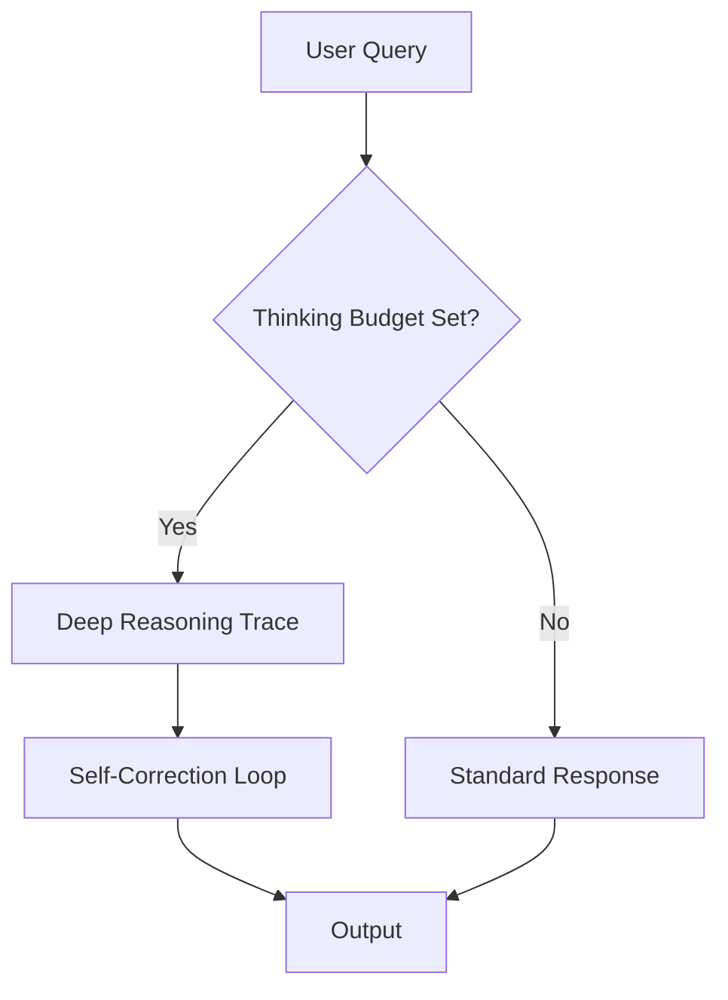

# Anthropic Claude (Extended Thinking)

## Overview
Claude's "Extended Thinking" allows users to define a "thinking budget" (tokens) for the model. This enables the model to spend more time on complex logic and multi-step planning.

## History
- **Claude 3.5 Sonnet Release:** June 20, 2024.
- **Extended Thinking (Claude 3.7):** February 24, 2025.

## Architecture Diagram

## Technical Resources
- **Announcement:** [Claude 3.7 Sonnet](https://www.anthropic.com/news/claude-3-7-sonnet)
- **Model Card:** [Claude 3.5 Model Card](https://www.anthropic.com/claude-3-5-sonnet-model-card.pdf)
