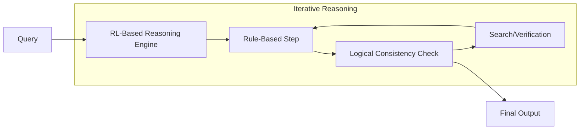

# DeepSeek R1

## Overview
DeepSeek R1 is a major open-weight reasoning model that uses large-scale Reinforcement Learning (RL) to achieve reasoning performance comparable to proprietary models like o1. It performs heavy, rule-based reasoning natively.

## History
- **DeepSeek R1 Release:** January 20, 2025.

## Architecture Diagram

## Technical Resources
- **Research Paper:** [DeepSeek-R1 Paper (arXiv)](https://arxiv.org/abs/2501.12948)
- **GitHub Repo:** [DeepSeek-R1 Source](https://github.com/deepseek-ai/DeepSeek-R1)
