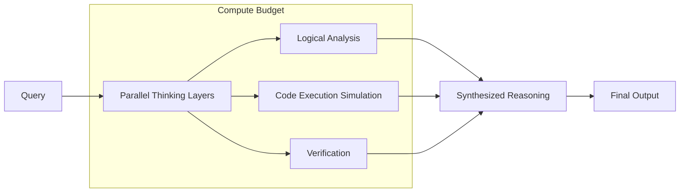

# Google Gemini (Deep Think)

## Overview
Google Gemini's "Deep Think" mode allows the model to allocate additional compute time to "reason through" complex queries. It uses a parallel thinking architecture that excels in math, coding, and scientific research.

## History
- **Deep Think Rollout:** August 1, 2025 (Gemini 2.5 Deep Think).

## Architecture Diagram

## Technical Resources
- **Technical Report:** [Gemini 2.5 Technical Report](https://storage.googleapis.com/deepmind-media/gemini/gemini_2_5_report.pdf)
- **Announcement:** [Gemini 2.5: Deep Think](https://blog.google/products/gemini/gemini-2-5-deep-think/)
