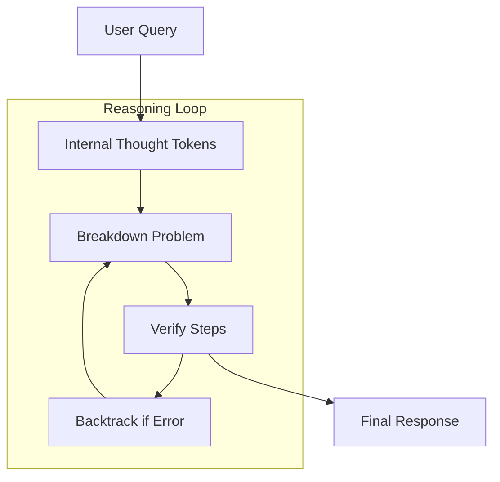

# OpenAI o-series (o1 and o3-mini)

## Overview
The OpenAI o-series represents a shift from standard next-token prediction to models specifically trained for reasoning. These models use Large-Scale Reinforcement Learning (RL) to generate internal Chain-of-Thought (CoT) tokens before producing a final answer.

## History
- **First Used:** September 12, 2024 (o1-preview and o1-mini).
- **Full Release:** December 5, 2024 (o1-pro and full o1).

## Architecture Diagram

## Technical Resources
- **System Card:** [OpenAI o1 System Card](https://arxiv.org/abs/2412.16720)
- **Blog Post:** [Learning to Reason with LLMs](https://openai.com/index/learning-to-reason-with-llms/)
