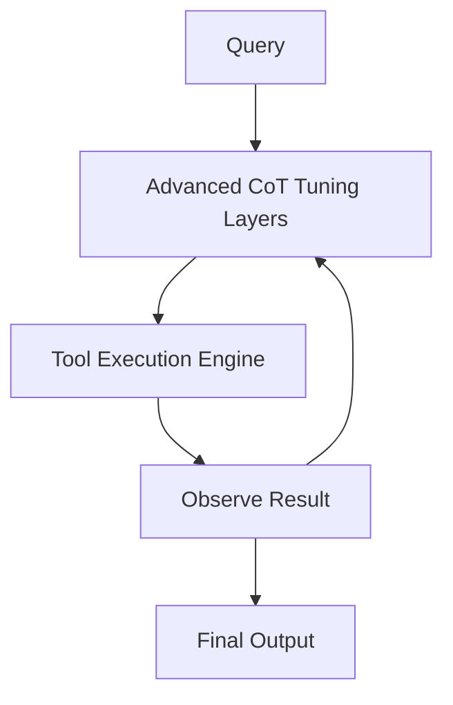

# Qwen-Max

## Overview
Qwen-Max is Alibaba's flagship proprietary model. The latest versions, such as Qwen 3.7-Max, are optimized for long-horizon autonomous tasks and complex tool-use using advanced CoT tuning.

## History
- **Qwen 2.5-Max Release:** January 28, 2025.
- **Qwen 3.7-Max Release:** May 19, 2026.

## Architecture Diagram

## Technical Resources
- **Technical Report:** [Qwen2.5 Technical Report](https://arxiv.org/abs/2412.15115)
- **Blog Post:** [Qwen 3.7: The Agent Frontier](https://qwenlm.github.io/blog/qwen3.7/)
