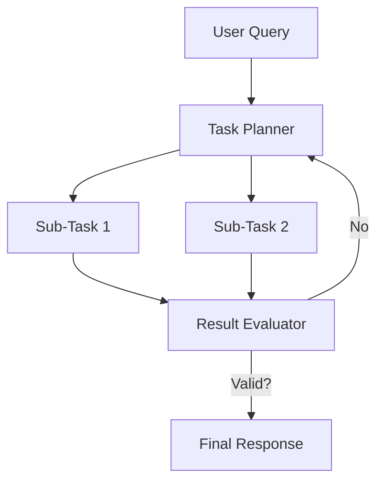

# xAI Grok (Think Mode)

## Overview
Grok 3 features a dedicated "Think Mode" and "DeepSearch" capability. It is designed to handle complex coding and mathematical reasoning by breaking down tasks into sub-tasks.

## History
- **Grok 3 Announcement:** February 17, 2025.

## Architecture Diagram

## Technical Resources
- **Blog Post:** [Grok 3](https://x.ai/blog/grok-3)
- **Official Announcement:** [Elon Musk on X](https://x.com/elonmusk/status/1891340445854134544)
